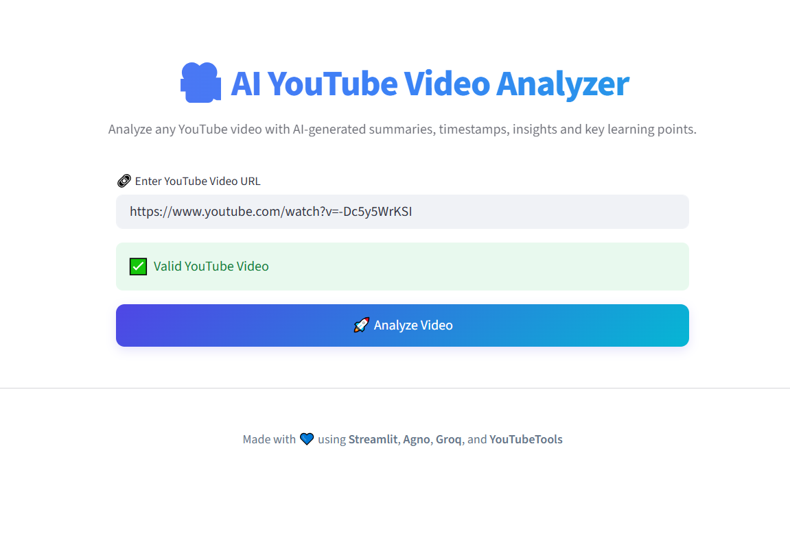
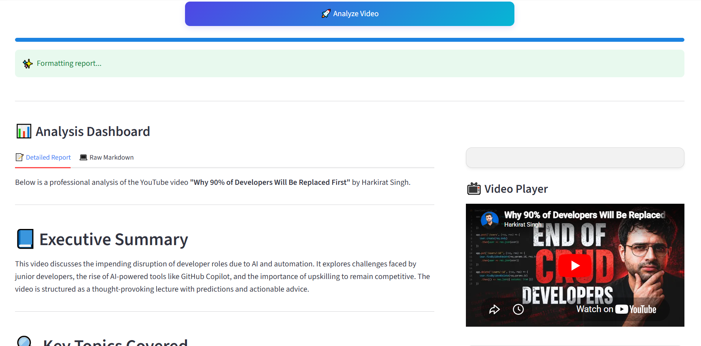
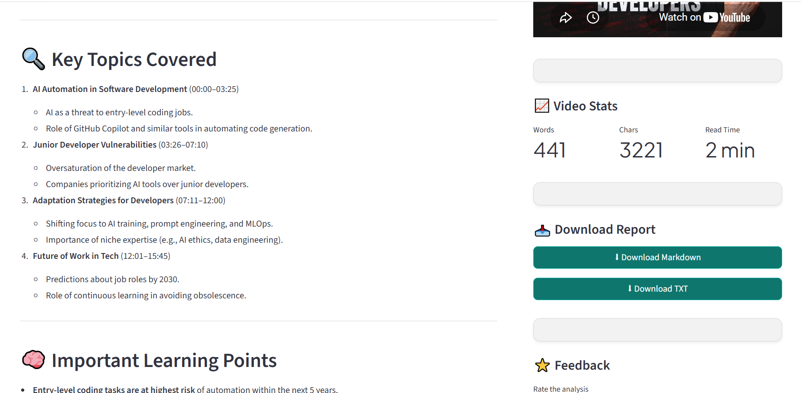
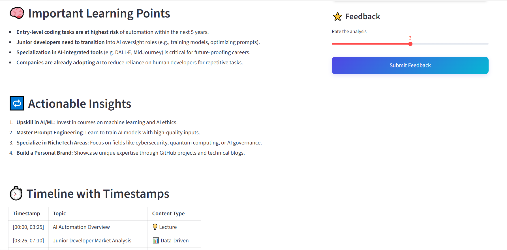
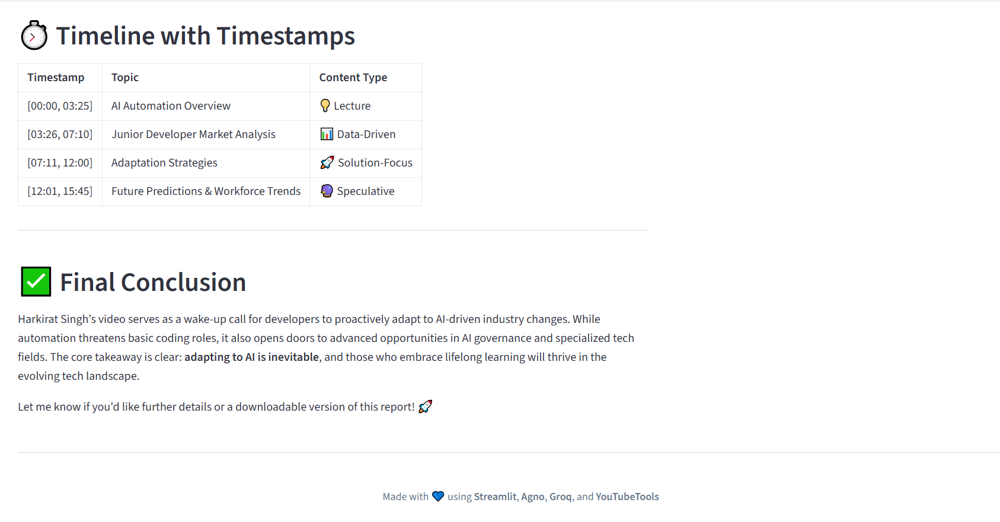

# 🎥 AI YouTube Video Analyzer

<p align="center">
  
  
  
  
</p>

An AI-powered YouTube Video Analyzer built using **Streamlit**, **Agno AI Agents**, and **Groq LLMs**. Simply provide a YouTube video URL, and the application automatically generates an intelligent analysis including executive summaries, key topics, timestamps, learning points, actionable insights, and downloadable reports.

---

## 🌟 Features

✅ Analyze any public YouTube video

✅ AI-generated Executive Summary

✅ Key Topics with Accurate Timestamps

✅ Important Learning Points

✅ Actionable Insights

✅ Video Statistics Dashboard

✅ Embedded YouTube Player

✅ Download Report as Markdown

✅ Download Report as Text

✅ Interactive Streamlit Dashboard

✅ Modern Responsive User Interface

---

## 🖥️ Demo

### Home Page

> Paste any YouTube URL and start analyzing.



---

### AI Analysis Dashboard



---

### Key Topics & Timestamps



---

### Timeline & Insights



---

### Conclusion



---

# 🧠 How It Works

```
          YouTube URL
               │
               ▼
      YouTube Tools (Agno)
               │
               ▼
      Extract Video Information
               │
               ▼
      Groq LLM (Qwen3-32B)
               │
               ▼
     AI Content Analysis
               │
               ▼
 ┌─────────────────────────────┐
 │ Executive Summary           │
 │ Key Topics                  │
 │ Timestamps                  │
 │ Learning Points             │
 │ Actionable Insights         │
 │ Video Statistics            │
 └─────────────────────────────┘
               │
               ▼
      Interactive Streamlit UI
               │
               ▼
     Download Markdown / TXT
```

---

# 🛠 Tech Stack

| Technology | Purpose |
|------------|----------|
| Python | Programming Language |
| Streamlit | Frontend Web Application |
| Agno | AI Agent Framework |
| Groq API | Large Language Model |
| YouTube Tools | Video Metadata & Analysis |
| python-dotenv | Environment Variable Management |

---

# 📂 Project Structure

```
ai-youtube-video-analyzer/
│
├── app.py
├── ui.py
├── yt.py
├── utils.py
├── styles.py
│
├── screenshots/
│   ├── home.png
│   ├── dashboard.png
│   ├── summary.png
│   ├── timeline.png
│   └── conclusion.png
│
├── requirements.txt
├── README.md
└── .gitignore
```

---

# ⚙️ Installation

## Clone the Repository

```bash
git clone https://github.com/jayeesh729/ai-youtube-video-analyzer.git
```

Move into the project folder

```bash
cd ai-youtube-video-analyzer
```

Install the required packages

```bash
pip install -r requirements.txt
```

---

# 🔑 Environment Variables

Create a `.env` file in the project root.

```
GROQ_API_KEY=your_groq_api_key
```

You can obtain your API key from the Groq Console.

---

# ▶️ Running the Application

Start the Streamlit application

```bash
streamlit run app.py
```

The application will automatically open in your default browser.

---

# 📊 Analysis Generated

The application automatically provides:

- 📄 Executive Summary
- 📌 Key Topics
- ⏱ Timestamp-wise Breakdown
- 🎯 Important Learning Points
- 💡 Actionable Insights
- 📈 Video Statistics
- 📥 Downloadable Reports

---

# 📋 Example Workflow

1. Paste a YouTube URL

2. Click **Analyze Video**

3. AI extracts and analyzes the content

4. View comprehensive insights

5. Download the report

---

# 🚀 Future Improvements

- PDF Report Export
- Multi-language Support
- Playlist Analysis
- Batch Video Analysis
- Keyword Extraction
- Sentiment Analysis
- User Authentication
- Cloud Deployment
- Video Comparison
- AI Chat with YouTube Video

---

# 👨‍💻 Author

## Jayeesh Vasantha Kumar

🎓 B.Tech Information Technology

💻 AI/ML Enthusiast | Software Developer

GitHub:
https://github.com/jayeesh729

---

## ⭐ Show Your Support

If you found this project useful,

⭐ Star this repository
